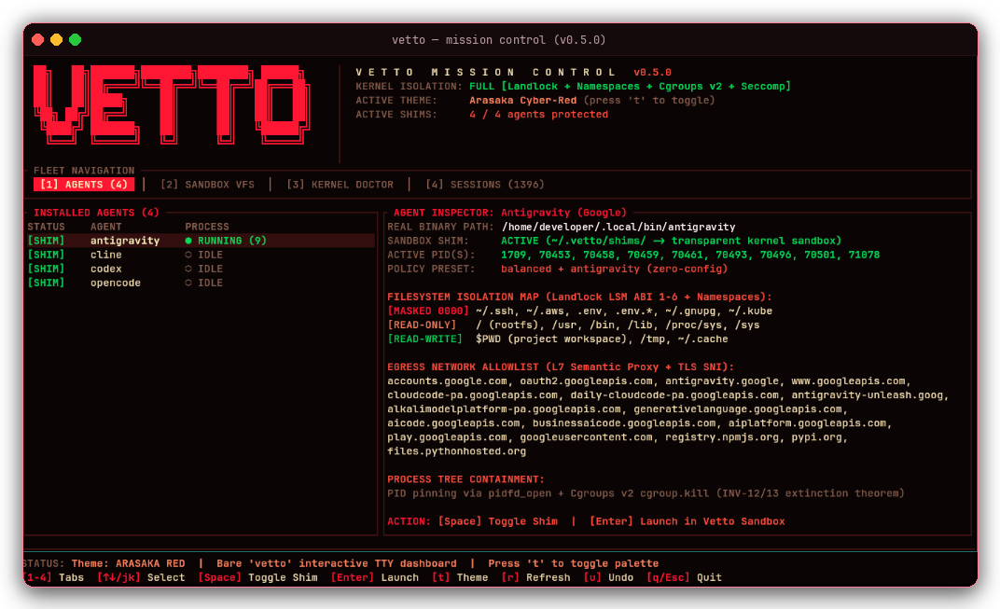

<p align="center">
  <a href="https://github.com/shleder/vetto/actions"></a>
  <a href="https://github.com/shleder/vetto/releases/tag/v0.5.0"></a>
  <a href="https://www.npmjs.com/package/@shledery/vetto"></a>
  <a href="https://crates.io/crates/vetto"></a>
  <a href="../LICENSE"></a>
</p>

<p align="center">
  <a href="../README.md">English</a> |
  <a href="README.ru.md">Русский</a> |
  <a href="README.zh.md">简体中文</a> |
  <a href="README.ja.md">日本語</a> |
  <a href="README.es.md"><b>Español</b></a> |
  <a href="README.de.md">Deutsch</a>
</p>

Entorno de ejecución (runtime) sin demonios (daemon-less) y sin privilegios de root (rootless) para aislamiento a nivel de kernel y aplicación de políticas de seguridad en agentes de codificación CLI (**Claude Code**, **OpenAI Codex**, **Cursor**, **Gemini**, **OpenCode**, **Aider**, **Antigravity**). Vetto inyecta límites de seguridad inmutables directamente entre `fork()` y `execve()` con una latencia de inicio inferior a 4 ms y sin sobrecarga de Docker.

---

## Panel Interactivo TUI Mission Control

A partir de **v0.5.0**, ejecutar simplemente `vetto` en cualquier terminal interactivo abre el panel ciberpunk **Mission Control**:

```bash
vetto
```

- **Detección Dinámica de Agentes**: Escanea automáticamente `$PATH` y muestra únicamente los agentes instalados en tu sistema (`claude`, `codex`, `gemini`, `opencode`, `cursor`, `aider`, `cline`, `continue`, `goose`, `openhands`, `smolagents`), ocultando limpiamente los no presentes.
- **Control con Una Sola Tecla**:
  - `[1: AGENTS]`: Monitoreo en vivo de procesos, alternancia de shims de PATH (`Espacio`), e inicio instantáneo en sandbox (`Enter`).
  - `[2: SANDBOX VFS]`: Matriz de enmascaramiento de secretos a nivel de inodo (`mode=0000` tmpfs sobre `~/.ssh`, `~/.aws`, `.env`).
  - `[3: KERNEL DOCTOR]`: Verificación en vivo de Landlock LSM ABI (v1–v6), espacios de nombres de usuario (`CLONE_NEWUSER`), cgroups v2 (`cgroup.kill`) y Seccomp-BPF.
  - `[4: SESSIONS]`: Sesiones activas y reversión instantánea de instantáneas (snapshots) sin pérdida de datos (`u`).
- **Dos Temas Cibernéticos**: Arasaka Cyber-Red (predeterminado) y Cyber Circuit (fósforo ámbar), intercambiables al instante con la tecla `t`.
- **Cero Sobrecarga**: Scripts, entornos no interactivos y tuberías Unix eluden el TUI automáticamente sin demora de inicio.

---

## Pruebas Antes de Promesas

Los agentes autónomos ejecutan código no determinista. Los hooks de dependencias no confiables, inyecciones de prompts o comandos Bash alucinados pueden comprometer credenciales del host (`~/.ssh`, `~/.aws`, `.env`) o dejar servidores huérfanos. Bajo Vetto, las llamadas al sistema no autorizadas se bloquean de forma determinista:

```text
> Leyendo ~/.ssh/id_rsa...         BLOQUEADO (máscara de secreto, EACCES)
> Abriendo socket crudo (raw)...   BLOQUEADO (espacio de nombres de red, EAFNOSUPPORT)
> Creando demonio en segundo plano... TERMINADO (extinción del árbol de procesos, exit 125)
```


### Contrato Fail-Closed (Código de Salida 125)

Si se vulnera un límite de aislamiento o no se pueden aplicar las funciones necesarias del kernel, la ejecución se termina de inmediato con el **código de salida 125**. Todos los subprocesos y procesos huérfanos se eliminan sincrónicamente mediante cgroups v2 `cgroup.kill`. Las funciones no compatibles con el SO se reportan claramente como no admitidas—la seguridad nunca se degrada silenciosamente.

---

## Inicio Rápido

### 1. Instalación

Mediante gestores de paquetes estándar:

```bash
# npm (binario global multiplataforma)
npm install -g @shledery/vetto

# Homebrew (macOS y Linux)
brew install shleder/tap/vetto

# Cargo (crates.io)
cargo install vetto
```

O mediante el instalador directo de curl:

```bash
curl -fsSL https://raw.githubusercontent.com/shleder/vetto/main/install.sh | sh
```

### 2. Aislamiento Transparente de Agentes (PATH-Shims)

Habilita el aislamiento sin configuración para tu agente de codificación. Vetto instala un shim no destructivo en `~/.vetto/shims` con prioridad en `PATH`:

```bash
vetto enable claude   # compatible con codex, opencode, gemini, cursor, aider y más de 20 agentes
claude                # se ejecuta normalmente, totalmente confinado en el kernel
```

Para restaurar la ejecución nativa sin aislamiento:

```bash
vetto disable claude
```

### 3. Ejecución Directa y Eval Aislado

Ejecuta scripts independientes con políticas estrictas predeterminadas:

```bash
vetto run -- python script.py
vetto -- npm test
```

Evalúa fragmentos de código de forma segura con techos de memoria cgroups v2 y tiempos límite monotónicos:

```bash
vetto eval --python -c "print(1 + 1)" --timeout 5 --memory 256
```

### 4. Reversión Instantánea de Snapshots

Vetto crea instantáneas automáticas de copia en escritura del espacio de trabajo antes de ejecutar el agente:

```bash
vetto diff        # inspecciona los cambios exactos realizados por el agente
vetto undo        # revierte el espacio de trabajo al estado limpio previo a la ejecución
```

### 5. Diagnóstico del Kernel

Audita las capacidades de aislamiento del kernel del host:

```bash
vetto doctor --preflight          # audita Landlock ABI, namespaces y cgroups v2
vetto doctor --preflight --json   # salida estructurada en formato JSON
```

---

## Niveles de Garantía por Plataforma

| Plataforma / Nivel | Aislamiento de Sistema de Archivos | Aislamiento de Red | Ciclo de Vida de Procesos | Estado |
| :--- | :--- | :--- | :--- | :--- |
| **Linux (Nativo)**<br>Tier 1 | **Landlock LSM (ABI 1–6)**<br>Enmascaramiento de inodos para `~/.ssh`, `~/.aws`, `.env` (tmpfs 0000) | **Espacios de nombres de red (`CLONE_NEWNET`)**<br>Aislamiento de loopback + broker local L7 con inspección SNI | **Espacios de nombres PID (`CLONE_NEWPID`)**<br>Extinción determinista de procesos vía `cgroups v2` | Producción |
| **Linux (WSL2)**<br>Tier 1 | **Landlock LSM mediante kernel WSL2**<br>Restricción total de inodos | **Namespaces de red dentro de VM**<br>Broker de salida aislado | **PID namespaces + barrido de `/proc`**<br>Extinción total de huérfanos | Producción (Recomendado para Windows) |
| **macOS (Darwin)**<br>Tier 2 | **Seatbelt (`libsandbox.1.dylib`)**<br>Escritura confinada a `$PROJECT` y `/tmp` | **Bloqueo de red**<br>`--net=off` mediante reglas `(deny network*)` | **Supervisión de grupos de procesos**<br>Control mediante watchdog kqueue / `pidfd` | Estándar (Requiere Acceso Total al Disco para `~/Documents`) |
| **Windows Nativo**<br>Tier 3 | **AppContainer y LPAC**<br>Restricción mediante tokens DACL | **Restricción de capacidades**<br>SIDs de red restringidos | **Objetos de Trabajo (Job Objects)**<br>`JOB_OBJECT_LIMIT_KILL_ON_JOB_CLOSE` | Básico (Use WSL2 para garantías Tier 1) |

---

## Integridad Criptográfica

Todos los binarios se construyen en entornos aislados de GitHub Actions y cuentan con verificación pública:

- **SLSA Level 3 Provenance**: Atestaciones de compilación in-toto para todos los binarios.
- **Firmas Minisign**: Publicadas bajo la clave pública `75ECEC9B5080C590`.
- **Sumas de Verificación SHA-256**: Comprobación automática durante la instalación.

---

## Licencia

Distribuido bajo la licencia Apache 2.0 ([LICENSE](../LICENSE)).
