<p align="center">
  <a href="https://github.com/shleder/vetto/actions"></a>
  <a href="https://github.com/shleder/vetto/releases/tag/v0.5.0"></a>
  <a href="https://www.npmjs.com/package/@shledery/vetto"></a>
  <a href="https://crates.io/crates/vetto"></a>
  <a href="../LICENSE"></a>
</p>

<p align="center">
  <a href="../README.md">English</a> |
  <a href="README.ru.md"><b>Русский</b></a> |
  <a href="README.zh.md">简体中文</a> |
  <a href="README.ja.md">日本語</a> |
  <a href="README.es.md">Español</a> |
  <a href="README.de.md">Deutsch</a>
</p>

Бесфоновый (daemon-less) и беспривилегированный (rootless) runtime для изоляции на уровне ядра и контроля политик AI-агентов, пишущих код (**Claude Code**, **OpenAI Codex**, **Cursor**, **OpenCode**, **Aider**, **Antigravity**, **OMP**, **ZCode**, **Kimi**, **Grok**). Vetto внедряет неизменяемые границы безопасности напрямую между `fork()` и `execve()` с задержкой запуска менее 4 мс и без накладных расходов Docker.

---

## Интерактивный TUI Mission Control

Запустите интерактивную панель управления Mission Control простой командой `vetto` в любом терминале:

```bash
vetto
```

Включает динамическое обнаружение установленных AI-агентов, переключение PATH-шимов в одно касание, аудит матрицы секретов VFS, живую диагностику ядра и мгновенный откат снапшотов.

Подробное руководство по горячим клавишам, вкладкам и темам оформления вынесено в отдельный документ: [Инструкция по Mission Control TUI](tui.md).

---

## Доказательства вместо обещаний

Автономные агенты выполняют недетерминированный код. Недоверенные хуки зависимостей, инъекции в промпты или галлюцинированные bash-команды могут скомпрометировать учетные данные хоста (`~/.ssh`, `~/.aws`, `.env`) или оставить неуправляемые фоновые серверы. Под Vetto несанкционированные системные вызовы детерминированно блокируются:

```text
> Reading ~/.ssh/id_rsa...         BLOCKED (secret mask, EACCES)
> Opening raw socket...             BLOCKED (net namespace, EAFNOSUPPORT)
> Spawning detached daemon...       TERMINATED (process tree extinction, exit 125)
```



### Fail-Closed Contract (Exit 125)

Если граница изоляции нарушена или необходимые примитивы ядра не могут быть применены, выполнение немедленно прерывается с **кодом возврата 125**. Деревья дочерних процессов и осиротевшие подпроцессы уничтожаются синхронно через cgroups v2 `cgroup.kill`. Гарантии, которые базовая ОС не может обеспечить, помечаются как неподдерживаемые — скрытого снижения уровня безопасности не происходит.

---

## Быстрый старт

### 1. Установка

Через стандартные пакетные менеджеры:

```bash
# npm (кроссплатформенный глобальный бинарник)
npm install -g @shledery/vetto

# Homebrew (macOS & Linux)
brew install shleder/tap/vetto

# Cargo (crates.io)
cargo install vetto
```

Или через скрипт-установщик:

```bash
curl -fsSL https://raw.githubusercontent.com/shleder/vetto/main/install.sh | sh
```

### 2. Прозрачная изоляция агентов (PATH-шимы)

Включите изоляцию без предварительной настройки для вашего агента. Vetto устанавливает прозрачный шим в `~/.vetto/shims` с приоритетом в системном `PATH`:

```bash
vetto enable claude   # поддержка codex, opencode, cursor, aider, antigravity и 18 профилей
claude                # запускается привычно, но исполняется внутри песочницы ядра
```

Для возврата к нативному неизолированному запуску:

```bash
vetto disable claude
```

### 3. Прямой запуск и изолированный eval

Запуск изолированных скриптов со строгими политиками по умолчанию:

```bash
vetto run -- python script.py
vetto -- npm test
```

Безопасное тестирование сниппетов кода с ограничением памяти cgroups v2 и аппаратным таймаутом:

```bash
vetto eval --python -c "print(1 + 1)" --timeout 5 --memory 256
```

### 4. Мгновенный откат снапшотов

Vetto автоматически делает легковесные copy-on-write снапшоты рабочей директории перед выполнением агента:

```bash
vetto diff        # просмотр изменений, внесенных агентом в файлы
vetto undo        # мгновенный откат рабочей копии к чистому состоянию до запуска
```

### 5. Диагностика ядра и префлайт-проверка

Проверка возможностей изоляции хостового ядра и контейнерных ограничений:

```bash
vetto doctor --preflight          # аудит Landlock ABI, неймспейсов и cgroups v2
vetto doctor --preflight --json   # машиночитаемый вывод состояния окружения
```

---

## Платформенные гарантии

Vetto реализует строгую трехтирную модель изоляции на базе непривилегированных примитивов ядра:

| Платформа / Тир | Изоляция файловой системы | Сетевая изоляция | Жизненный цикл процессов | Статус |
| :--- | :--- | :--- | :--- | :--- |
| **Linux (Native)**<br>Tier 1 | **Landlock LSM (ABI 1–6)**<br>Маскирование inode для `~/.ssh`, `~/.aws`, `.env` (tmpfs 0000) | **Сетевые пространства имен (`CLONE_NEWNET`)**<br>Изоляция loopback + локальный TCP/TLS брокер с проверкой SNI | **PID-пространства (`CLONE_NEWPID`)**<br>Детерминированное уничтожение дерева процессов через `cgroups v2` | Production |
| **Linux (WSL2)**<br>Tier 1 | **Landlock LSM через ядро WSL2**<br>Полное ограничение inode | **Сетевые пространства внутри VM**<br>Изолированный брокер egress | **PID-неймспейсы + зачистка `/proc`**<br>Гарантированное уничтожение сирот | Production (Рекомендовано для Windows) |
| **macOS (Darwin)**<br>Tier 2 | **Seatbelt (`libsandbox.1.dylib`)**<br>Ограничение записи рамками `$PROJECT` и `/tmp` | **Сетевой локдаун**<br>`--net=off` через правила `(deny network*)` | **Зачистка групп процессов**<br>Контроль через `pidfd` / kqueue watchdog | Standard (Требуется Full Disk Access для `~/Documents`) |
| **Windows Native**<br>Tier 3 | **AppContainer & LPAC**<br>Ограничение токенов DACL | **Блокировка возможностей**<br>Ограниченные сетевые SID | **Job Objects**<br>`JOB_OBJECT_LIMIT_KILL_ON_JOB_CLOSE` | Guardrail (Используйте WSL2 для гарантий Tier 1) |

---

## Матрица поддерживаемых AI-агентов

Vetto включает готовые профили безопасности (`profiles/agents/*.toml`), автоматические сетевые разрешения, динамическое монтирование кэшей пакетных менеджеров (`npm`, `uv`, `bun`) и проброс графических дисплеев для Computer Use для 18 ведущих агентских рантаймов:

| Агент | Команда / Пресет | Автоматические сетевые домены | Плагины и пути состояния |
| :--- | :--- | :--- | :--- |
| **Claude Code** | `claude` | `api.anthropic.com`, `claude.ai` | `~/.claude`, `~/.config/claude`, плагины |
| **OpenAI Codex** | `codex` | `api.openai.com`, ChatGPT OAuth | `~/.codex`, `~/.config/codex`, плагины |
| **OpenCode** | `opencode` | Динамические эндпоинты JSONC (AIHubMix, Nvidia) | `~/.local/share/opencode`, `~/.config/opencode` |
| **Antigravity** | `agy`, `antigravity` | Google APIs, Google CDN, телеметрия | `~/.gemini/antigravity`, плагины, скиллы |
| **OMP** | `omp` | `omp.sh`, Anthropic, OpenAI, Google, OpenRouter | `~/.config/omp`, `~/.omp`, project local `.omp` |
| **ZCode** | `zcode` | `z.ai`, `api.z.ai`, `glm.z.ai`, OpenAI | `~/.zcode`, `~/.config/zcode` |
| **Kimi Code** | `kimi` | `code.kimi.com`, `api.moonshot.cn`, `api.moonshot.ai` | `~/.kimi`, `~/.config/kimi` |
| **Grok Build** | `grok` | `x.ai`, `api.x.ai`, `grok.com` | `~/.grok`, `~/.config/grok` |
| **Cursor** | `cursor` | Бэкенд Cursor, маркетплейс расширений | Сокеты IPC VS Code, `~/.cursor` |
| **Aider** | `aider` | Эндпоинты настроенных LLM-провайдеров | Корень git-репозитория, история сессий |
| **Cline** | `cline` | `api.cline.bot`, `data.cline.bot` | Хост расширений VS Code, кэши браузера |
| **Windsurf** | `windsurf` | `api.codeium.com`, `windsurf.codeium.com` | `~/.windsurf`, состояние Cascade |
| **Goose** | `goose` | Block API, Anthropic, Databricks | `~/.config/goose`, расширения |
| **OpenHands** | `openhands` | Эндпоинты выбранных моделей | Локальное выполнение без Docker |
| **Devin** | `devin` | `api.devin.ai`, `cognition.ai` | `~/.devin`, `~/.config/devin` |
| **GitHub Copilot** | `copilot` | `api.github.com`, эндпоинты Copilot | `~/.config/github-copilot` |
| **Smolagents** | `smolagents` | `huggingface.co`, `hf.co` | `~/.cache/huggingface`, кэши PyTorch |

---

## Безопасность и криптографическая целостность

Релизы собираются в полностью изолированных пайплайнах GitHub Actions с публичной верификацией:

- **SLSA Level 3 Provenance**: аттестации сборки in-toto генерируются для всех платформенных бинарников.
- **Подписи Minisign**: публикуются с каждым архивом под публичным ключом `75ECEC9B5080C590`.
- **Криптографические контрольные суммы**: автономные хэши SHA-256 верифицируются при установке.

---

## Документация

- [Бэкенды платформ и спецификация границ](platform-backends.md)
- [Реестр пресетов и профилей агентов](agents.md)
- [Модель угроз и архитектурные допущения](threat-model.md)
- [Диагностическая верификация ядра](architecture/verify-ng.md)
- [Коды возврата и сценарии сбоев](exit-codes.md)
- [Сообщение об уязвимостях (SECURITY.md)](../SECURITY.md)

---

## Участие в разработке

Мы приветствуем вклад сообщества. Создавайте отдельные ветки от `main`. Все изменения границ безопасности должны сопровождаться соответствующими тестами ядра. Все пулл-реквесты валидируются на раннерах Linux, macOS и Windows в GitHub Actions CI.

---

## Лицензия

Распространяется под лицензией Apache License, Version 2.0 ([LICENSE](../LICENSE)).
