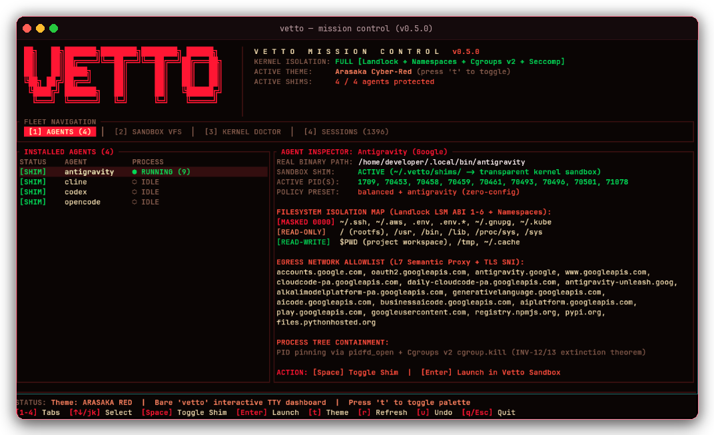

<p align="center">
  <a href="https://github.com/shleder/vetto/actions"></a>
  <a href="https://github.com/shleder/vetto/releases/tag/v0.5.15"></a>
  <a href="https://www.npmjs.com/package/@shledery/vetto"></a>
  <a href="https://crates.io/crates/vetto"></a>
  <a href="../LICENSE"></a>
</p>

<p align="center">
  <a href="../README.md">English</a> |
  <a href="README.ru.md"><b>Русский</b></a> |
  <a href="README.zh.md">简体中文</a> |
  <a href="README.ja.md">日本語</a> |
  <a href="README.es.md">Español</a> |
  <a href="README.de.md">Deutsch</a>
</p>

Vetto — это непривилегированный sandbox для AI CLI-агентов (Claude Code, OpenAI Codex, Cursor, OpenCode, Aider). Он изолирует файловую систему, сетевые сокеты и дочерние процессы между вызовами `fork()` и `execve()`, используя встроенные механизмы ядра Linux и macOS без фонового демона и без root-привилегий.

---

## Контроль границ на уровне ядра

AI-агенты запускают сгенерированные шелл-команды и скрипты сборки. Если агент попытается прочитать приватные ключи, открыть сырой сетевой сокет или создать фоновый процесс-демон, Vetto блокирует операцию на уровне ядра:

```text
> Reading ~/.ssh/id_rsa...         BLOCKED (secret mask, EACCES)
> Opening raw socket...             BLOCKED (net namespace, EAFNOSUPPORT)
> Spawning detached daemon...       TERMINATED (process tree extinction, exit 125)
```

### Завершение по принципу fail-closed (код 125)

При нарушении политики или отсутствии в ядре необходимого механизма изоляции Vetto немедленно завершает работу с кодом 125. Все дочерние процессы и фоновые задачи синхронно уничтожаются через `cgroup.kill` в cgroups v2. Если операционная система не может применить заданное правило, Vetto сообщает об отсутствующей возможности и останавливается, не допуская работы со сниженным уровнем безопасности.

---

## Быстрый старт

### 1. Установка

Через пакетные менеджеры:

```bash
# npm (кроссплатформенный бинарник)
npm install -g @shledery/vetto

# Homebrew (macOS и Linux)
brew install shleder/tap/vetto

# Cargo (crates.io)
cargo install vetto
```

Либо через скрипт установки curl:

```bash
curl -fsSL https://raw.githubusercontent.com/shleder/vetto/main/install.sh | sh
```

### 2. Прозрачный перехват агентов

Подключение изоляции для установленных AI-агентов без изменения настроек шелла и алиасов:

```bash
vetto enable --all
```

Vetto находит в `$PATH` поддерживаемые бинарники агентов (`claude`, `codex`, `cursor`, `opencode`, `aider`, `antigravity` и др.) и размещает перехватывающие шимы в `~/.vetto/shims`.

После включения запускайте агентов как обычно:

```bash
claude                # выполняется в песочнице с политиками Landlock LSM
cursor                # выполняется с защитой учетных данных и фильтрацией сети
```

Управление отдельными агентами:

```bash
vetto enable claude    # изолировать только claude
vetto disable claude   # вернуть прямой запуск без изоляции
```

### Сравнение с Docker

AI-агентам нужны локальные компиляторы, существующие кэши пакетов и интерактивный терминал. Запуск в Docker требует развертывания тяжелых контейнеров, тогда как Vetto накладывает ограничения ядра прямо на процессы хоста:

| Параметр | Docker / DinD | Vetto |
| :--- | :--- | :--- |
| Накладные расходы на запуск | 500–2000 мс на создание контейнера | Менее 4 мс холодного старта между `fork()` и `execve()` |
| Использование памяти | Фоновый процесс `dockerd` | 0 МБ фоновой памяти (нет демона) |
| Модель привилегий | Требует `root` или группу `docker` | Непривилегированные user namespaces, Landlock LSM и cgroups v2 |
| Инструментарий | Требует пересборки образов | Прямой доступ к хостовым `cargo`, `npm`, `pip`, `uv` |
| Кэши пакетов | Volume mounts или повторные загрузки | Прямое переиспользование кэшей хоста |
| Очистка процессов | Может оставлять осиротевшие контейнеры | Синхронное уничтожение дерева процессов через `cgroup.kill` cgroups v2 |

### 3. Прямой запуск

Запуск произвольных команд внутри песочницы:

```bash
vetto run -- python script.py
vetto -- npm test
```

### 4. Откат изменений рабочего каталога (снапшоты)

Перед началом работы агента Vetto создает copy-on-write снимок рабочего каталога:

```bash
vetto diff        # показать измененные, добавленные или удаленные агентом файлы
vetto undo        # вернуть рабочую директорию в состояние до запуска
```

### 5. Диагностика хоста

Проверка доступных на машине примитивов изоляции ядра:

```bash
vetto doctor --preflight          # аудит Landlock ABI, пространств имен и cgroups v2
vetto doctor --preflight --json   # отчет о диагностике в формате JSON
```

---

## Интеграция с GitHub Actions

Запуск AI-агентов в CI обычно влечет за собой Docker-in-Docker, что увеличивает время загрузки образов, часто требует привилегированных раннеров и не переносится на раннеры вне Linux.

Action `shleder/vetto` запускает агентов на стандартных раннерах GitHub Actions без Docker:

- Холодный старт менее 4 мс с криптографической проверкой бинарника.
- Безрутовый Landlock LSM и cgroups v2 на стандартных раннерах Ubuntu.
- Прямой доступ к `$GITHUB_WORKSPACE` и кэшам экшенов (`actions/cache`, `actions/setup-node`, `actions/setup-python`).
- Корректная зачистка всех подпроцессов через `cgroup.kill`.
- Кроссплатформенная работа на Ubuntu, macOS и Windows.

### Вариант A: Шаг запуска агента в песочнице

Запуск агента с политикой сетевых доменов и генерацией отчета SARIF:

```yaml
name: Agent Security Gate
on: [pull_request]

jobs:
  verify:
    runs-on: ubuntu-latest
    permissions:
      contents: read
      security-events: write
    steps:
      - uses: actions/checkout@v4

      - name: Run Sandboxed Agent
        uses: shleder/vetto@v0.5.15
        with:
          command: 'npx @anthropic-ai/claude-code -p "Run linter and fix basic formatting"'
          agent: 'claude'
          profile: 'strict'
          fail-on-block: '1'
          upload-sarif: 'true'
        env:
          ANTHROPIC_API_KEY: ${{ secrets.ANTHROPIC_API_KEY }}
```

### Вариант B: Установка Vetto для многошаговых пайплайнов

Если параметр `command` опущен, экшен устанавливает бинарник `vetto` в `$GITHUB_PATH`:

```yaml
      - name: Setup Vetto
        uses: shleder/vetto@v0.5.15
        with:
          version: 'latest'

      - name: Run Sandboxed Commands
        run: |
          vetto doctor --preflight
          vetto run -- aider --message "Refactor parser error handling"
```

---

## Работа с терминалом и статуслайн

Интерактивные агенты (Claude Code, Codex) сами управляют состоянием терминала (PTY). Vetto сохраняет прямой ввод-вывод терминала и отображает состояние песочницы:

- **Статуслайн (`--tui=statusline`)**: режим по умолчанию для неинтерактивных команд. Показывает активные политики файлов и сети в нижней строке терминала.
- **Headless-режим (`--tui=none` / `--ci`)**: отключает отрисовку терминального интерфейса. Используется в CI, скриптах и при перенаправлении стандартных потоков.

---

## Поддержка платформ

Vetto использует непривилегированные средства изоляции каждой операционной системы:

| Платформа | Изоляция файлов | Изоляция сети | Жизненный цикл процессов | Тир |
| :--- | :--- | :--- | :--- | :--- |
| **Linux (Native)** | **Landlock LSM (ABI 1–6)**<br>Маскирование tmpfs над `~/.ssh`, `~/.aws`, `.env` | **Сетевые пространства имен (`CLONE_NEWNET`)**<br>Изоляция loopback с локальным TCP/TLS прокси | **PID namespaces (`CLONE_NEWPID`)**<br>Зачистка дерева процессов через `cgroup.kill` cgroups v2 | Tier 1 (Полный) |
| **Linux (WSL2)** | **Landlock LSM через ядро WSL2**<br>Ограничение путей файловой системы | **Сетевые пространства внутри VM**<br>Фильтрация исходящих соединений | **PID namespaces и сканирование `/proc`**<br>Полное уничтожение дерева | Tier 1 (Полный) |
| **macOS (Darwin)** | **Seatbelt (`libsandbox.1.dylib`)**<br>Запрет записи вне рабочего каталога и `/tmp` | **Ограничение сети**<br>`--net=off` блокирует IP; `--net=allowlist` через loopback-прокси | **Надзор за процессами**<br>Watchdog отслеживает группы дочерних процессов | Tier 2 (Целевой Tier 1.5) |
| **Windows Native** | **AppContainer и LPAC**<br>Контроль доступа на уровне токенов | **Ограничение возможностей**<br>Ограниченные сетевые SID | **Job Objects**<br>`JOB_OBJECT_LIMIT_KILL_ON_JOB_CLOSE` | Tier 3 (Guardrail) |

### Особенности Seatbelt на macOS

В macOS отсутствуют непривилегированные сетевые пространства имен. Vetto применяет Apple Seatbelt (`libsandbox.1.dylib`) для ограничения записи и защиты учетных данных. В режиме `--net=off` блокируется сетевой трафик и IPC к `mDNSResponder`. В режиме `--net=allowlist` Vetto запускает локальный прокси на `127.0.0.1` и разрешает исходящий TCP-трафик на этот порт. Чтение файлов в macOS настроено широко для корректного взаимодействия с системным кэшем dyld.

---

## Поддерживаемые AI-агенты

Vetto содержит готовые профили для более чем 25 инструментов AI-разработки. Профили ограничивают сетевой трафик официальными эндпоинтами провайдеров и защищают учетные данные, сохраняя доступ к кэшам пакетов:

| Агент | Бинарник / Пресет | Сетевые эндпоинты | Защищаемые конфигурации и кэши |
| :--- | :--- | :--- | :--- |
| **Claude Code** | `claude` | `api.anthropic.com`, `claude.ai` | `~/.claude`, `~/.config/claude`, плагины |
| **OpenAI Codex** | `codex` | `api.openai.com`, ChatGPT OAuth | `~/.codex`, `~/.config/codex`, плагины |
| **Cursor** | `cursor` | Бэкенд Cursor, маркетплейс расширений | Сокеты IPC VS Code, `~/.cursor` |
| **Aider** | `aider` | Эндпоинты настроенных LLM-провайдеров | Корень git-репозитория, история сессий |

Полный список поддерживаемых агентов, сетевых правил и путей доступен в [Реестре совместимости агентов](agents.md).

---

## Python SDK (`vetto-python`)

Пакет в `../sdk/python/` предоставляет привязки для запуска изолированных команд и шагов агентов:

```python
from vetto import VettoSandbox, VettoSecurityError, VettoTimeoutError

sandbox = VettoSandbox(
    project_dir=".",
    network="allowlist:api.anthropic.com,api.openai.com",
    profile="default",
    timeout_secs=60,
)

# Запуск команды в песочнице. При нарушении политики (exit 125) вызывает VettoSecurityError.
result = sandbox.run(["pytest", "tests/"])
```

### Интеграция с LangGraph

Пакет содержит `VettoToolNode` для изоляции вызова инструментов в графах LangGraph:

```python
from vetto.langgraph import VettoToolNode

tool_node = VettoToolNode(
    tools=[search_tool, execute_code_tool],
    network="off",
    timeout_secs=30,
)
```

---

## Интеграции в апстрим-проекты

Vetto развивает изоляцию процессов для открытых агентских фреймворков:

| Фреймворк | Issue | Pull Request | Детали |
| :--- | :--- | :--- | :--- |
| **CrewAI** | [#7830](https://github.com/crewAIInc/crewAI/issues/7830) | [PR #7831](https://github.com/crewAIInc/crewAI/pull/7831) | Изоляция непривилегированных процессов `VettoExecTool` и `VettoPythonTool` с контролем границ и таймаутами. |
| **Microsoft AutoGen** | [#8298](https://github.com/microsoft/autogen/issues/8298) | [PR #8299](https://github.com/microsoft/autogen/pull/8299) | Изоляция без контейнеров `VettoCommandLineCodeExecutor` в `autogen-ext`. |
| **OpenClaw** | [#160522](https://github.com/openclaw/openclaw/issues/160522) | [PR #161125](https://github.com/openclaw/openclaw/pull/161125) | Ограничение памяти кучи по порогам `--max-old-space-size`. |
| **Hugging Face smolagents** | [#2845](https://github.com/huggingface/smolagents/issues/2845) | [PR #2860](https://github.com/huggingface/smolagents/pull/2860) | `ProcessIsolatedExecutor` с жестким астрономическим таймаутом и зачисткой группы процессов. |
| **browser-use** | [#5879](https://github.com/browser-use/browser-use/issues/5879) | [PR #5929](https://github.com/browser-use/browser-use/pull/5929) | DNS-префлайт с блокировкой loopback, RFC 1918, CGNAT и метаданных облачных платформ. |
| **OpenHands** | [#4266](https://github.com/OpenHands/software-agent-sdk/issues/4266) | [PR #5344](https://github.com/OpenHands/software-agent-sdk/pull/5344) | Бэкенд `LandlockWorkspace` с автодетекцией ABI 1–6 Linux Landlock. |
| **Block goose** | [#12522](https://github.com/aaif-goose/goose/issues/12522) | [PR #12545](https://github.com/aaif-goose/goose/pull/12545) | `SubprocessExt` изоляция с отслеживанием subreaper и пространствами имен. |
| **Block goose (ACP)** | [#12513](https://github.com/aaif-goose/goose/issues/12513) | [PR #12563](https://github.com/aaif-goose/goose/pull/12563) | Политика запуска шелла (`GOOSE_ACP_CLIENT_TERMINAL`) с обнаружением песочницы. |
| **Cline** | [#14544](https://github.com/cline/cline/issues/14544) | [PR #14583](https://github.com/cline/cline/pull/14583) | Изоляция терминала и маскирование секретов (`~/.ssh`, `.env`) в `ClineIgnoreController`. |
| **Qwen Code** | [#12856](https://github.com/QwenLM/qwen-code/issues/12856) | [PR #12953](https://github.com/QwenLM/qwen-code/pull/12953) | Очистка исходящих учетных данных и защита каталога проекта. |
| **Claude Code History Viewer** | [#509](https://github.com/jhlee0409/claude-code-history-viewer/issues/509) | [PR #595](https://github.com/jhlee0409/claude-code-history-viewer/pull/595) | Валидация входных данных и флагов возобновления сессий. |

---

## Верификация и целостность

Релизы собираются через автоматизированные процессы GitHub Actions с публичной проверкой:

- **SLSA Level 3 Provenance**: аттестации сборки in-toto генерируются для релизных бинарников.
- **Подписи Minisign**: публикуются с каждым релизным архивом под публичным ключом `75ECEC9B5080C590`.
- **Контрольные суммы SHA-256**: проверяются установочными скриптами автоматически.

---

## Документация

- [Бэкенды платформ и спецификация изоляции](platform-backends.md)
- [Пресеты агентов и конфигурация](agents.md)
- [Модель угроз и границы безопасности](threat-model.md)
- [Диагностические проверки preflight](architecture/verify-ng.md)
- [Коды возврата и режимы сбоев](exit-codes.md)
- [Политика безопасности и сообщение об уязвимостях](../SECURITY.md)

---

## Участие в разработке

Мы приветствуем предложения и код. Создавайте пулл-реквесты в ветку `main`. Любые изменения границ безопасности должны сопровождаться интеграционными тестами. Проверки PR выполняются на раннерах Linux, macOS и Windows в GitHub Actions CI.

---

## Лицензия

Распространяется на условиях лицензии Apache License, Version 2.0 ([LICENSE](../LICENSE)).
